# 🏰 GodthroneRPG

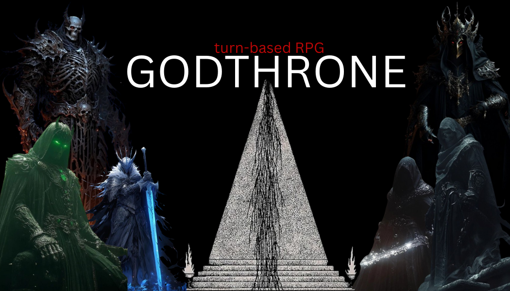

**GodthroneRPG** is a sophisticated turn-based role-playing game built with Kaplay, delivering an immersive pixel-art experience with deep strategic gameplay mechanics. Embark on epic quests, engage in tactical combat, and forge your legend in a world where every decision matters.

---

## 📚 Table of Contents

- [🏰 GodthroneRPG](#-godthronerpg)
  - [📚 Table of Contents](#-table-of-contents)
  - [🌟 Overview](#-overview)
  - [🏗️ System Architecture](#️-system-architecture)
  - [✨ Features](#-features)
    - [👤 Player Experience](#-player-experience)
    - [⚔️ Combat System](#️-combat-system)
    - [🎮 Game Mechanics](#-game-mechanics)
  - [🔧 Technical Stack](#-technical-stack)
  - [💻 Getting Started](#-getting-started)
    - [⚙️ Prerequisites](#️-prerequisites)
    - [🚀 Installation \& Setup](#-installation--setup)
    - [🕹️ Running the Game](#️-running-the-game)
  - [🗂️ Project Structure](#️-project-structure)
  - [🎯 Gameplay Guide](#-gameplay-guide)
  - [🔮 Future Roadmap](#-future-roadmap)
  - [🤝 Contributing](#-contributing)
  - [📄 License](#-license)

---

## 🌟 Overview

**GodthroneRPG** represents a modern take on classic turn-based RPGs, combining nostalgic gameplay elements with contemporary game design principles. Built on the robust Kaplay engine, the game features a modular architecture that supports complex gameplay systems while maintaining performance and extensibility.

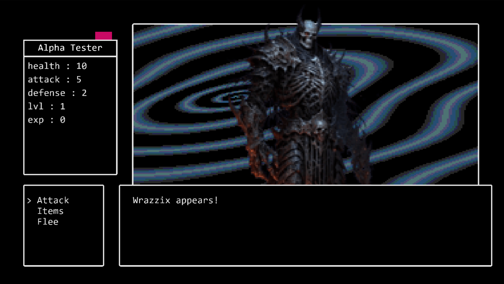
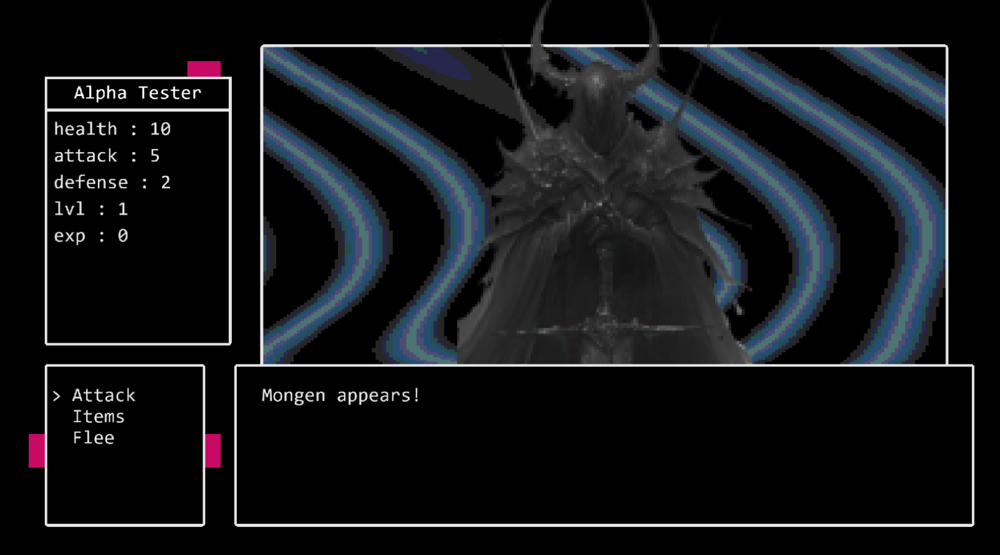
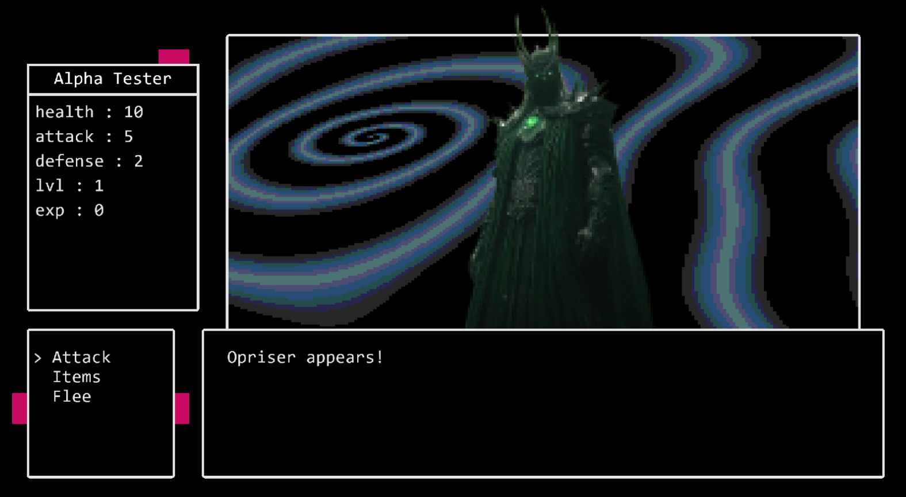
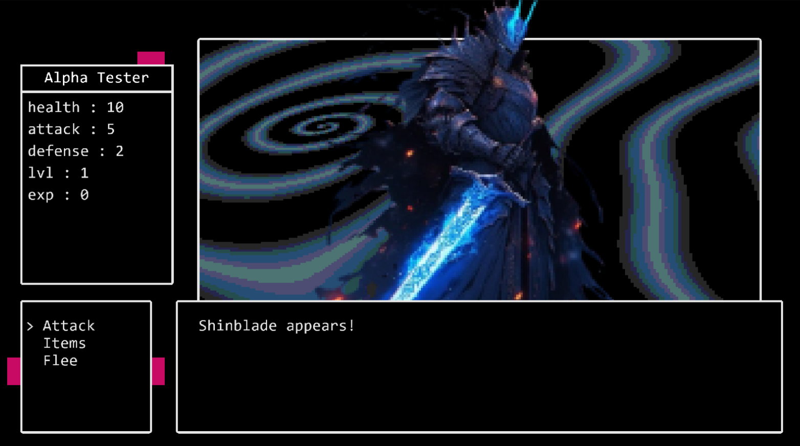
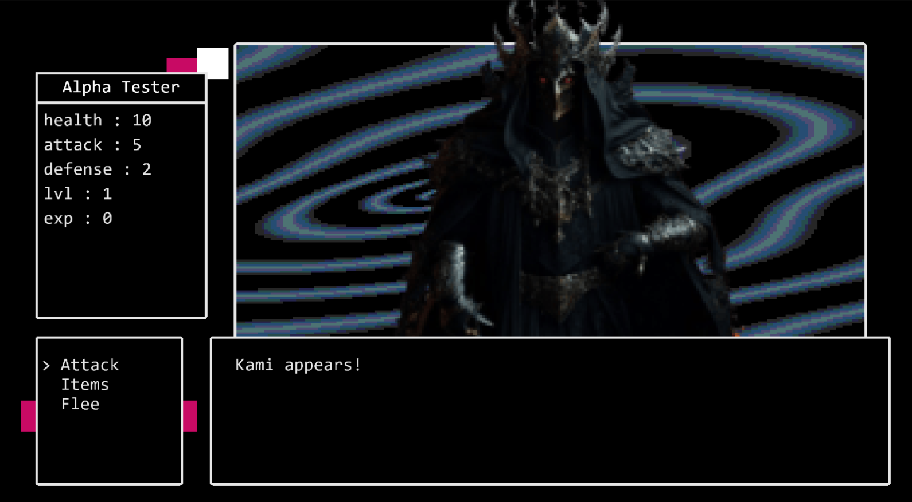
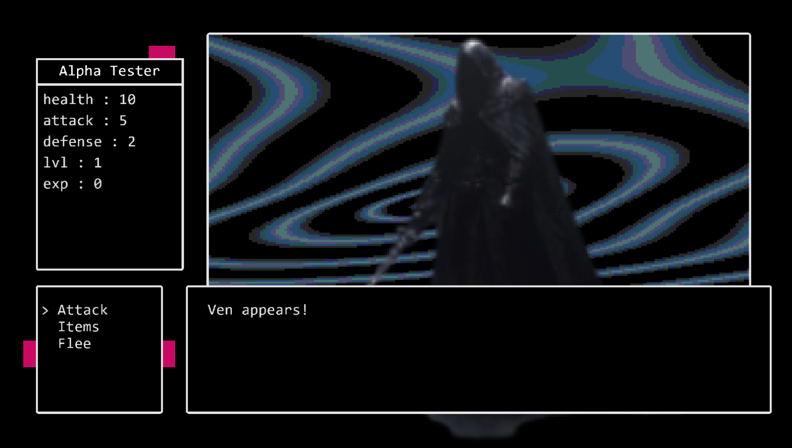
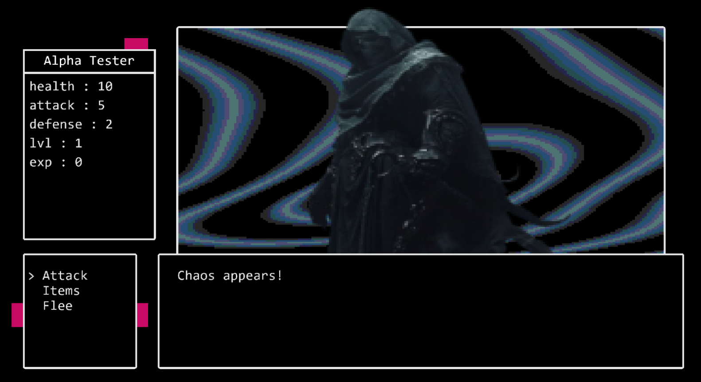
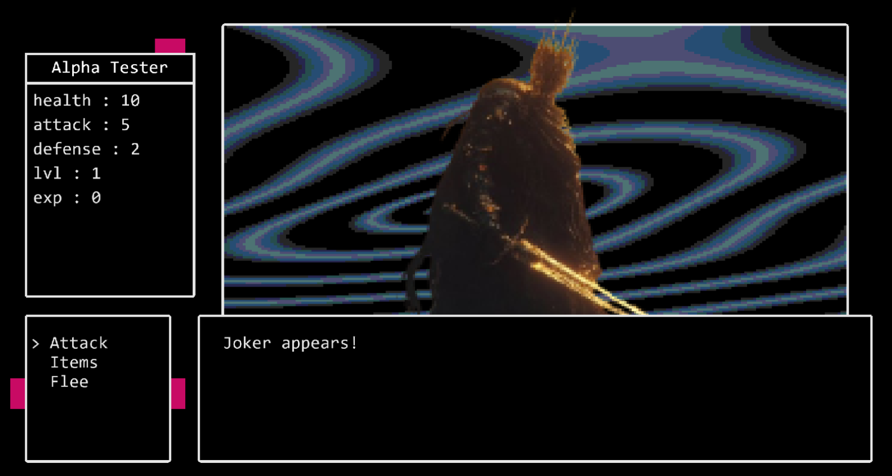
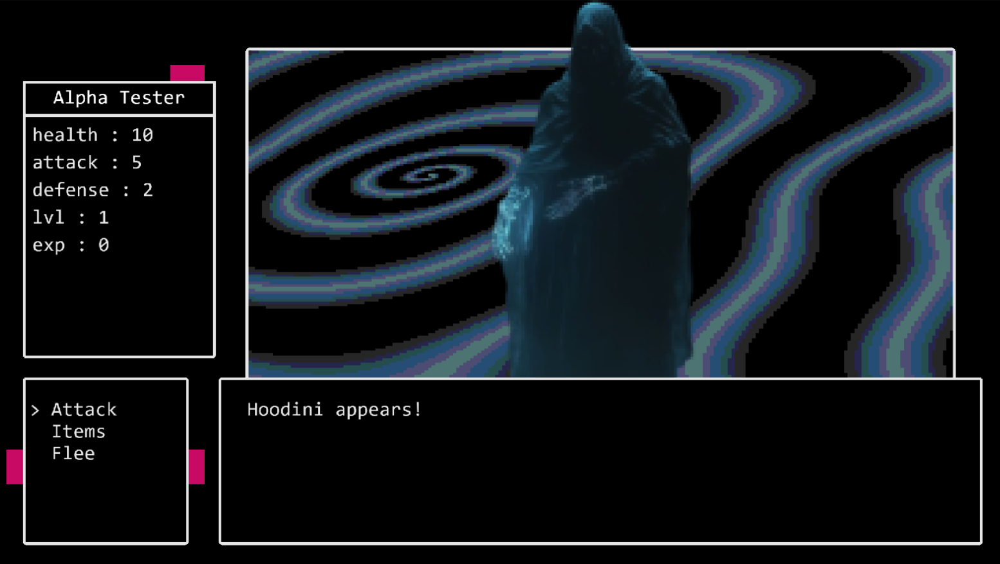

The game emphasizes strategic decision-making, character progression, and immersive storytelling through its carefully crafted mechanics and atmospheric pixel-art presentation.


---

## 🏗️ System Architecture

The following UML class diagram illustrates the core architecture and relationships within GodthroneRPG:

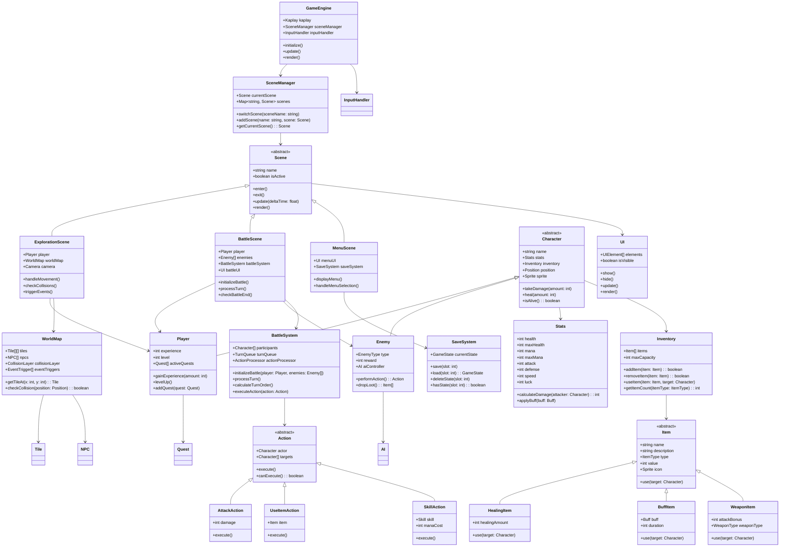

---

## ✨ Features

### 👤 Player Experience
- **🚶 Dynamic Exploration**: Navigate richly detailed environments with interactive elements
- **📊 Character Progression**: Deep leveling system with customizable stat allocation
- **🎒 Advanced Inventory**: Comprehensive item management with categorization and sorting
- **💬 Interactive Dialogue**: Engaging conversations with NPCs that affect story outcomes
- **🏆 Achievement System**: Track progress and unlock rewards for various accomplishments

### ⚔️ Combat System
- **🎯 Strategic Turn-Based Combat**: Plan your moves carefully in tactical battles
- **⚡ Skill System**: Unlock and master powerful abilities as you progress
- **🛡️ Equipment Management**: Equip weapons, armor, and accessories for stat bonuses
- **🎲 Dynamic Damage Calculation**: Combat outcomes influenced by stats, equipment, and RNG
- **👥 Party Formation**: Build and manage a team of diverse characters

### 🎮 Game Mechanics
- **💾 Robust Save System**: Multiple save slots with detailed progress tracking
- **🌍 Procedural Events**: Random encounters and events that keep gameplay fresh
- **📈 Difficulty Scaling**: Adaptive challenge that grows with player progression
- **🎵 Dynamic Audio**: Immersive soundtrack that responds to game state
- **⚙️ Customizable Settings**: Adjust graphics, audio, and gameplay preferences

---

## 🔧 Technical Stack

- **🎮 Engine**: Kaplay (JavaScript game development framework)
- **🎨 Graphics**: Custom pixel-art sprites and animations
- **🔊 Audio**: Web Audio API for dynamic sound management
- **💾 Storage**: LocalStorage for save data persistence
- **📱 Compatibility**: Cross-platform support (Desktop, Mobile, Web)

---

## 💻 Getting Started

### ⚙️ Prerequisites

- **Node.js** (v16.0 or higher) - [Download here](https://nodejs.org/)
- **npm** (comes with Node.js) or **yarn** package manager
- Modern web browser with ES6+ support (Chrome 80+, Firefox 75+, Safari 13+)

### 🚀 Installation & Setup

1. **Clone the repository:**
   ```bash
   git clone https://github.com/your-username/GodthroneRPG.git
   cd GodthroneRPG
   ```

2. **Install dependencies:**
   ```bash
   npm install
   # or
   yarn install
   ```

3. **Install development tools (optional):**
   ```bash
   npm install -g @kaplay/cli
   ```

### 🕹️ Running the Game

**Development Mode:**
```bash
npm run dev
# or
yarn dev
```

**Production Build:**
```bash
npm run build
npm run preview
```

**Testing:**
```bash
npm run test
```

Access the game at `http://localhost:5173/`

---

## 🗂️ Project Structure

```
GodthroneRPG/
├── 📁 src/
│   ├── 📁 scenes/          # Game scenes (exploration, battle, menu)
│   ├── 📁 entities/        # Character classes and game objects
│   ├── 📁 systems/         # Core game systems (battle, inventory, save)
│   ├── 📁 ui/              # User interface components
│   ├── 📁 utils/           # Utility functions and helpers
│   ├── 📁 data/            # Game data (items, enemies, maps)
│   └── 📄 main.js          # Application entry point
├── 📁 assets/
│   ├── 📁 sprites/         # Character and environment sprites
│   ├── 📁 audio/           # Music and sound effects
│   ├── 📁 maps/            # Level data and tilesets
│   └── 📁 ui/              # UI graphics and fonts
├── 📁 docs/                # Documentation and guides
├── 📁 tests/               # Unit and integration tests
├── 📄 package.json         # Project dependencies and scripts
├── 📄 vite.config.js       # Build configuration
└── 📄 README.md           # This file
```

---

## 🎯 Gameplay Guide

**Getting Started:**
1. Create your character and customize stats
2. Complete the tutorial to learn basic mechanics
3. Explore the starting village and accept your first quest
4. Engage in battles to gain experience and loot
5. Visit shops to upgrade equipment and buy supplies

**Combat Tips:**
- Study enemy patterns and weaknesses
- Balance offensive and defensive actions
- Manage your resources (health, mana, items) carefully
- Experiment with different skill combinations
- Save before challenging boss encounters

**Progression Strategy:**
- Focus on core stats that match your playstyle
- Keep a diverse inventory of healing and buff items
- Complete side quests for additional rewards
- Explore thoroughly to find hidden treasures
- Save frequently to preserve your progress

---

## 🔮 Future Roadmap

- **🌐 Multiplayer Mode**: Online co-op and competitive battles
- **🏰 Guild System**: Join guilds and participate in group activities
- **🎭 Character Classes**: Specialized roles with unique abilities
- **🌟 Prestige System**: End-game progression mechanics
- **📱 Mobile App**: Native mobile version with touch controls
- **🎨 Mod Support**: Community-created content and modifications
- **🌍 Expanded World**: Additional regions and storylines

---

## 🤝 Contributing

We welcome contributions from the community! Please read our [Contributing Guide](CONTRIBUTING.md) for details on:

- Code style and standards
- Development workflow
- Bug reporting process
- Feature request guidelines
- Pull request requirements

---

## 📄 License

This project is licensed under the MIT License - see the [LICENSE](LICENSE) file for details.

---

<div align="center">

**⭐ Star this repository if you enjoy playing Godthrone RPG! ⭐**

[🎮 Play Now](http://localhost:5173/) | [🐛 Report Bug](https://github.com/your-username/GodthroneRPG/issues) | [💡 Request Feature](https://github.com/your-username/GodthroneRPG/issues)

</div>